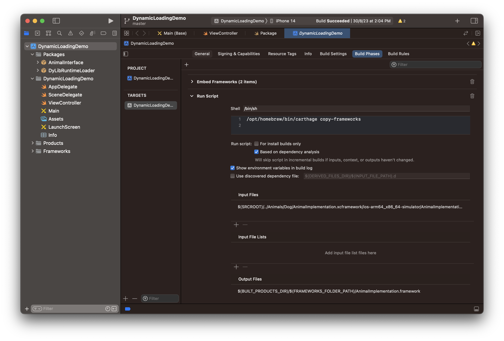
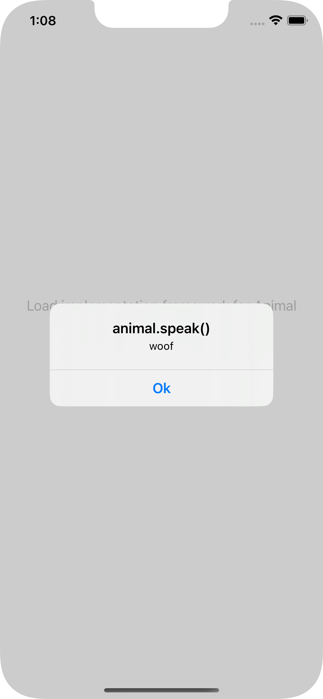

# DyLibRuntimeLoader
Lazy load the dynamic frameworks in runtime for iOS to reduce the App's launch time & more!


> *Binary is being loaded dynamically from SSD to RAM - Generated by AI*

## Dynamic loading
[Dynamic loading](https://en.wikipedia.org/wiki/Dynamic_loading) is a mechanism by which a computer program can, at run time, load a library (or other binary) into memory, retrieve the addresses of functions and variables contained in the library, execute those functions or access those variables, and unload the library from memory. 

It is one of the 3 mechanisms by which a computer program can use some other software; the other two are [static linking](https://en.wikipedia.org/wiki/Static_linking) and [dynamic linking](https://en.wikipedia.org/wiki/Dynamic_linking). Unlike static linking and dynamic linking, dynamic loading allows a computer program to start up in the absence of these libraries, to discover available libraries, and to potentially gain additional functionality.

## Dynamic loading for Apple platforms
MacOS officially supports Dynamic loading, you can follow the [Dynamic Library Programming Topics]( https://developer.apple.com/library/archive/documentation/DeveloperTools/Conceptual/DynamicLibraries/100-Articles/UsingDynamicLibraries.html). How about the iOS? Unfortunately, there aren't any official documents for iOS yet. Also, from the Xcode settings, we only see 2 options are static linking and dynamic linking, we assume Apple doesn't support Dynamic loading for iOS officially.

However, MacOS & iOS use the same [Darwin](https://en.wikipedia.org/wiki/Darwin_(operating_system)) kernel. Luckily, Darwin is mostly compatible with [POSIX](https://en.wikipedia.org/wiki/POSIX). POSIX introduced the [dlfcn](https://opensource.apple.com/source/dyld/dyld-132.13/include/dlfcn.h.auto.html) which is a standard instruction to work with run-time dynamic loading. You can see Apple open-sourced the [dylb](https://opensource.apple.com/source/dyld/) base on it.

This library bring the dynamic loading for iOS by using methods from POSIX's dlfcn.

## Interface modules
As the name, there're many benefits when using the [Interface modules](https://swiftrocks.com/reducing-ios-build-times-by-using-interface-targets) design. One of them is reducing the build time, today, along with dynamic loading, we'll get one more benefit: reduce the App's launch time: when App starts, it only load the interface modules, when app is running, it will load the concrete modules on demand by dynamic loading. You can see engineers in Meta has talked about this approach: [The evolution of Facebook’s iOS app architecture](https://engineering.fb.com/2023/02/06/ios/facebook-ios-app-architecture/). This library is mostly inspired from them!

---

## Installation
For now, we only support Swift Package Manager:
```swift
dependencies: [
    .package(url: "https://github.com/duyquang91/DylibRuntimeloader", .from("1.0.0"))
]
```
> **Note**
> This is a dynamic library 

## How to use
These steps will guide you how to use the library, you can download this repo & open the [Demo](./Demo/) project, everything is there for a quick experiment.

### Interface module
As mentioned above, it is a best practice to use this library with the [Interface module](https://swiftrocks.com/reducing-ios-build-times-by-using-interface-targets) design. First, we create a new package: [AnimalInterface](./Demo/Animals/AnimalInterface) at path: [./Demo/Animals/AnimalInterface](./Demo/Animals/AnimalInterface) and declare a public protocol [Animal](./Demo/Animals/AnimalInterface/Sources/AnimalInterface/AnimalInterface.swift):

```swift
import Foundation

public protocol Animal {
    func speak() -> String
}
```
> **Note**
> It must be a Dynamic library.

This simple packge describes how an animal speaks

### Implementation module

#### Dog
Now we create a new packge: [Dog](./Demo/Animals/Dog) at path: [./Demo/Animals/Dog/](./Demo/Animals/Dog/) then declare [AnimalInterface](./Demo/Animals/AnimalInterface) & [DylibRuntimeLoader](https://github.com/duyquang91/DyLibRuntimeLoader) as dependencies, the [Package.swift](./Demo/Animals/Dog/Package.swift) should look like this:

```swift
import PackageDescription

let package = Package(
    name: "AnimalImplementation",
    platforms: [.iOS(.v11)],
    products: [
        .library(
            name: "AnimalImplementation",
            type: .dynamic,
            targets: ["AnimalImplementation"]),
    ],
    dependencies: [
        .package(path: "../AnimalInterface"),
        .package(path: "../../..")
    ],
    targets: [
        .target(name: "AnimalImplementation", 
                dependencies: ["AnimalInterface", "DyLibRuntimeLoader"]),
    ]
)
```
> **Note**
> It must be a Dynamic library.

Now, the Dog must conform the [Animal](./Demo/Animals/AnimalInterface/Sources/AnimalInterface/AnimalInterface.swift) interface:

```swift
import AnimalInterface

struct Dog: Animal {
    func speak() -> String {
        "woof"
    }
}
```

You can see we don't declare [Dog](./Demo/Animals/Dog/Sources/AnimalImplementation/Dog.swift) as a public struct so when we import it into Demo project, we can't use it. The Dynamic loading technique actually will load the [Dog](./Demo/Animals/Dog/Sources/AnimalImplementation/Dog.swift) instance into the memory & cast it into public [Animal](./Demo/Animals/AnimalInterface/Sources/AnimalInterface/AnimalInterface.swift) interface. Now, let's expose our Dog instance as a symbol by using [DylibRuntimeLoader](https://github.com/duyquang91/DylibRuntimeloader)'s [dyLibCreator:](./Sources/DyLibRuntimeLoader/DyLibCreator.swift) method:

```swift
import DyLibRuntimeLoader
import AnimalInterface

@_cdecl("load_animal")
func load() -> UnsafeMutableRawPointer {
    dyLibCreator(factory: Dog(), forType: Animal.self)
}

struct Dog: Animal {
    func speak() -> String {
        "woof"
    }
}
```

> **Warning**: 
> You have to use the `@_cdecl("load_animal")` attribute, otherwise we can't retrieve the symbol to this instance later. DylibRuntimeLoader also mentioned this in the method's inline documentation. 

Now, build & export this [Dog](./Demo/Animals/Dog/Sources/AnimalImplementation/Dog.swift) package to a dynamic XCFramework (or Fat framework). If you're using Swift Package Manager, can use this tool: [swift-create-xcframework](https://github.com/unsignedapps/swift-create-xcframework). The final build is located at: [./Demo/Animals/Dog/AnimalImplementation.xcframework](Demo/Animals/Dog/AnimalImplementation.xcframework)

#### Cat

We repeat the quite same steps from [Dog](./Demo/Animals/Dog) package to create a dynamic package: [Cat](Demo/Animals/Cat/). The only difference is the speak method:

```swift
import DyLibRuntimeLoader
import AnimalInterface

@_cdecl("load_animal")
func load() -> UnsafeMutableRawPointer {
    dyLibCreator(factory: Cat(), forType: Animal.self)
}

struct Cat: Animal {
    func speak() -> String {
        "meow"
    }
}
```

You can find the final dynamic XCFramework: [./Demo/Animals/Cat/AnimalImplementation.xcframework](./Demo/Animals/Cat/AnimalImplementation.xcframework)

### Integration
Now, it is time to expirement the magic!

Open the Demo project at path: [Demo/DynamicLoadingDemo/DynamicLoadingDemo.xcodeproj](Demo/DynamicLoadingDemo/DynamicLoadingDemo.xcodeproj) to check the dependencies:


> **Note**
> DyLibRuntimeLoader & DyLibSampleInterface are linked dynamically

How about the implementation frameworks [Dog](./Demo/Animals/Dog) & [Cat](./Demo/Animals/Dog)? We don't link it as the traditional way like [DyLibRuntimeLoader](https://github.com/duyquang91/DyLibRuntimeLoader) & [AnimalInterface](./Demo/Animals/AnimalInterface) above, our project & Xcode shouldn't aware about it: don't link or import it, just copy it to the `Frameworks` directory by a new manual "Script" in the "Build Phases":



> **Note**
> I used a script from Carthage for quick demo, you can write your own script to work with XCFramework.

First, let's try to copy the [Dog](./Demo/Animals/Dog) framework. From now on, whenever we want to load the instance of [Animal](./Demo/Animals/AnimalInterface/Sources/AnimalInterface/AnimalInterface.swift), just use the [DyLibRuntimeLoader](https://github.com/duyquang91/DyLibRuntimeLoader)'s [dyLibLoad:](Sources/DyLibRuntimeLoader/DyLibRuntimeLoader.swift) method

```swift
let animal = try dyLibLoad(withSymbol: "load_animal", fromFramework: .framework(name: "AnimalImplementation"), forType: Animal.self)
```
You can find this code at the Demo's ViewController: [./Demo/DynamicLoadingDemo/DynamicLoadingDemo/ViewController.swift](./Demo/DynamicLoadingDemo/DynamicLoadingDemo/ViewController.swift)

> **Warning** 
> Use corresponding directory you copied the concrete framework into it, otherwise the framework can't be loaded.

Now, run the Demo project to figure it out:

| App is launched | Load the Dog instance | Tes the animal.speak() | 
| --- | --- | --- |
|  |  | |

## Experiment
Now, close the Xcode & let's try to tamper the Demo app. Find the current booted simulator's UUID:
```
xcrun simctl list | egrep '(Booted)'
```
Then go to find our app's `Frameworks` folder:

```
~/Library/Developer/CoreSimulator/Devices/{sim_uuid}/Data/Containers/Bundle/Application/{app_uuid}/DynamicLoadingDemo/Frameworks
```


Now try these actions by your self & restart the app to see the results:

|Action|Result|
|---|---|
|Delete `DyLibRuntimeLoader` or `AnimalInterface` framework|App will be crashed immediately because they're linked dynamically. When app is launched, iOS will load all linked dynamic frameworks, if any is missing, app will be crashed.|
|Delete `AnimalImplementation` framework|App is launched normally because Xcode is not aware about it while linking & iOS isn't aware about it as well because we run a manual script to copy it later.
|Replace the `AnimalImplementation` framework from [./Demo/Animals/Cat/AnimalImplementation.xcframework/ios-arm64_x86_64-simulator/AnimalImplementation.framework](./Demo/Animals/Cat/AnimalImplementation.xcframework/ios-arm64_x86_64-simulator/AnimalImplementation.framework) then check how `animal.speak()` func work?|The `animal.speak()` now should notice "meow". We just bypass the iOS integrity check, tamper & change the behaviour of the App. To do this on a real device, you need to jailbreak.|

The experiment above is an evident for the Dynamic loading for iOS, it may not quite exact how engineers at Meta did with [The evolution of Facebook’s iOS app architecture](https://engineering.fb.com/2023/02/06/ios/facebook-ios-app-architecture). I just try to mimic them to verify if it is really work, the result is fancy!  

## Benefits
We can easily preceive some benefits from this dynamic loading approach:

1. As mentioned by Meta's engineers, by dynamic loading, the App's launch time will be reduced significantly, especially with the bunch of dynamic frameworks! 
2. The implementation modules can hide the whole implementation & just expose as symbols, it maybe useful for some circumstances.
3. The implementation modules can be easily replaced without any integrity checks from Xcode/iOS so we can change the app's behaviour or perhaps update the App on the fly? Who know :D

## Appstore review
I already integrated the [DylibRuntimeLoader](https://github.com/duyquang91/DylibRuntimeloader) to my open source app: [Loan Calculator Plus](https://github.com/duyquang91/Loan-Calculator-Plus) & it's been approved by Apple. You can download it from the [Appstore](https://apps.apple.com/vn/app/loan-calculator-plus/id1501083494). It means Dynamic loading is unofficially supported by Apple but legal on Appstore. That's why Facebook app is alive till now.


